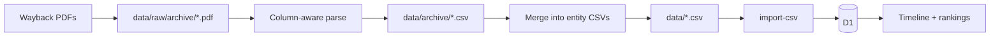

# Archive PDF backfill — design

Companion to [ARCHIVE-PLAN.md](../../../ARCHIVE-PLAN.md). Extends the live product past PlayHQ (2022+) using AMND Final Premiership Placings PDFs.

## Decisions (locked)

| Topic | Choice |
| --- | --- |
| Scope | Full product: fetch → parse → import → championship → UI |
| Seasons | AMND 2000–2014, 2016 only (16 PDFs). Gap years 2015 / 2017–2021 stay empty for later backfill |
| Era UI | One continuous timeline with a clear visual break at the gap + methodology change |
| Championship | Score archive seasons; label the break; suppress movement arrows across the gap |
| Top 4 | Keep rows; `position_uncertain = 1` when `ladder_position <= 4`; still score; no minor premiership |
| 2000–2005 title | Treat `Final Placings` as same `placement_basis = final_premiership_placings`; note title difference in season/result notes |
| Premier League archive | Out of scope (none found) |

## Why this shape

Archive data is placement-only and partly finals-contaminated. Kept as the same tables with flags (`source`, `placement_basis`, `position_uncertain`), each era stays honest while one timeline can still tell a long club story.

## Data flow

1. **Fetch** — one-time download of 16 PDFs from Wayback into `data/raw/archive/` (committed).
2. **Parse** — `pdftotext -bbox` (or equivalent) → column bands → staging CSVs under `data/archive/`.
3. **Resolve** — grade names via existing `parseGradeName` (+ per-year exceptions); club names via curated `club_aliases` with **fail-loud** on unknowns.
4. **Merge** — append archive seasons/grades/teams/results into the main entity CSVs (source of truth stays `data/*.csv`).
5. **Import** — existing `import-csv` path; no schema migration.
6. **UI** — extend coverage copy, method page, charts/tables for the era break.

## Identity

Importer requires non-null `playhq_id` on teams/results. Archive rows use stable synthetic IDs:

`archive:{season_key}:{grade_slug}:{club_key}:{squad_number}`

Season/grade `playhq_id` similarly prefixed. Never collide with real PlayHQ UUIDs.

## Flagging

Every archive result row:

- `source = archive_pdf`
- `placement_basis = final_premiership_placings`
- `position_uncertain = 1` iff `ladder_position <= 4`
- all match-stat columns null

## Championship / movement

- Existing formula already scores uncertain positions and withholds minor premierships.
- Extend `coverageChanged` (or sibling) so movement is suppressed when consecutive ranked years cross the archive→PlayHQ boundary (2016→2022), and when years are non-adjacent because of the gap.
- Coverage note explains methodology break + missing seasons; gap years remain eligible for later backfill without schema change.

## UI

- Ranked years include archive years; charts include spacer/break for missing years rather than implying continuity.
- Club points chart and home rankings show the full span with break styling.
- Method + coverage copy describe Final Premiership Placings vs regular-season ladders.
- Head-to-head / round results remain PlayHQ-only (no match data pre-2022).

## Out of scope

- Recovering 2015 / 2017–2021 from ResultsVault or private records
- Premier League pre-2022
- Match-level archive data
